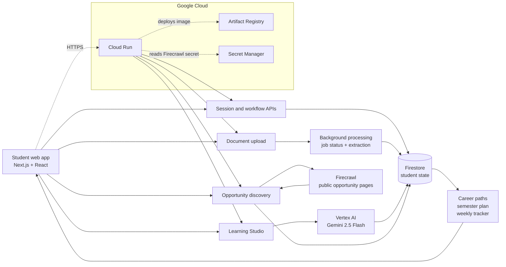

# Pathwise

## Evidence-first academic and career guidance for every student

**Pathwise** is an AI-enabled student guidance platform for flexible university programs. It helps a student turn scattered academic records, course choices, career interests, learning questions, and opportunities into a practical next-step plan.

**Live prototype:** https://career-coach-862478221175.us-central1.run.app  
**Source:** https://github.com/Ashinee-20/bpf-hackathon

---

## 1. The problem

Students in flexible programs have more choice—and more uncertainty. The information they need is spread across faculty advice, placement teams, LMS pages, PDFs, email, spreadsheets, and peer groups. This creates a fragmented, reactive experience:

- Which electives should I choose, and how do they fit my target path?
- What should I learn this week to make progress in my courses?
- Am I on track academically, and what is still unknown?
- Which conferences, competitions, hackathons, clubs, projects, or research opportunities are relevant?
- How do I turn an interest into evidence: a course result, reflection, project, or application?

Faculty and administrators repeatedly answer the same contextual questions, but each student needs a different answer. A static portal can store information; it cannot connect that information to the student’s current decision.

## 2. The solution

Pathwise provides one evidence-aware workspace that combines academic planning, learning support, and career exploration:

1. **Adaptive onboarding** captures the student’s program, semester, interests, time, and known academic position.
2. **Career Planner** compares multiple paths without inventing a compatibility score, shows prerequisites and evidence, and tracks progress for each selected path.
3. **My Semester** turns curriculum constraints into an explainable semester roadmap, including shared courses and unresolved prerequisites.
4. **Learning Studio** gives a focused explanation, example, and practice prompt through Vertex AI, with streaming responses, rendered Markdown, and preserved learning history.
5. **Enhance Profile** discovers live opportunities—hackathons, competitions, conferences, open source, and projects—through Firecrawl and lets the student prepare a grounded checklist.
6. **Tracker & This Week** combines academic actions, career experiments, saved opportunities, and portfolio projects into one measurable weekly view.
7. **Document processing** runs asynchronously so uploads can be acknowledged immediately while status and completion are visible in the profile.

## 3. Why it is worth solving

**For students:** less searching, clearer trade-offs, earlier intervention, and a concrete next action instead of generic advice.  
**For faculty and staff:** fewer repetitive questions and a consistent, auditable way to point students toward official constraints and resources.  
**For the university:** a scalable support layer that complements—not replaces—academic advisors, preserves uncertainty, and makes engagement visible before a student falls behind.

The product is deliberately evidence-first: official requirements and retrieved sources remain distinct from AI suggestions; unknown information stays unknown; and final academic decisions remain with the student and university.

## 4. How the prototype works

### Architecture notes

- **Frontend and API:** Next.js App Router provides the responsive student experience and server-side API routes.
- **AI:** `@ai-sdk/google-vertex` calls Gemini 2.5 Flash for learning explanations and preparation checklists. The model is not used for deterministic prerequisite or progress calculations.
- **Retrieval:** Firecrawl is used for public opportunity discovery and page verification; the app stores the retrieved opportunity metadata and source URL.
- **State:** Firestore stores normalized student state, interactions, documents, job status, saved opportunities, projects, and weekly completion.
- **Deployment:** A multi-stage Docker image is built in Cloud Build, stored in Artifact Registry, and served by Cloud Run. Runtime configuration uses Secret Manager and the Cloud Run service account.
- **Trust boundary:** AI suggestions are advisory. Official links, eligibility, deadlines, and unresolved information are surfaced so students can verify before acting.

## 5. Expected impact

Pathwise turns fragmented support into a reusable guidance loop:

**Understand context → compare options → choose a next action → learn or prepare → record evidence → update the plan.**

That loop reduces repetitive support work while giving each student a more personal, timely, and explainable path through university.

> **Prototype boundary:** Pathwise is a guidance and planning layer. It does not replace official registration, grading, fee, or university approval systems.
